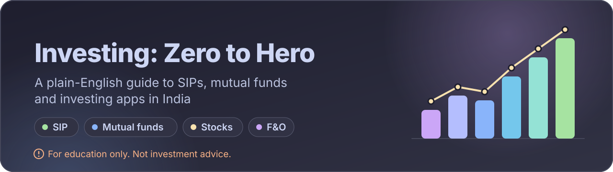
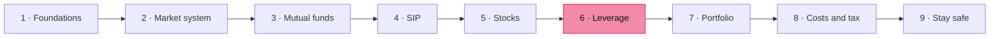

<p align="center">
  
</p>

<p align="center">
  <a href="https://bips-git.codeberg.page/investment/"><b>🌐 Read online</b></a>
  &nbsp;&nbsp;|&nbsp;&nbsp;
  <a href="https://github.com/bips-git/investment">🐙 GitHub</a>
  &nbsp;&nbsp;|&nbsp;&nbsp;
  <a href="https://codeberg.org/bips-git/investment">🏔️ Codeberg</a>
</p>

> [!CAUTION]
> **🎓 For education only. This is not an investment guide and it is not investment advice.**
>
> This project explains how money, markets, mutual funds, SIPs, stocks and derivatives work. It does **not** recommend, rate or promote any fund, stock, app, strategy or trade, and it cannot replace a SEBI-registered investment adviser.
>
> Investments in the securities market are subject to market risks. You can lose money, and leveraged products such as margin trading, futures and options can cause losses larger than you expect, sometimes more than you put in. Past performance does not guarantee future returns. Read all scheme-related documents carefully before you invest.

## 👋 What is this?

A free, open, plain-English course that takes you from *"what is inflation?"* to *"what does this button in my investing app actually do?"*

Most investing vocabulary sounds like a foreign language. Here, every tricky idea is **explained, not just defined**, with worked examples in ₹. The material is written from reputed university textbooks, regulator publications (SEBI, RBI, AMFI) and other reliable sources, and it is built to help you understand Groww-like apps well enough to stay safe with SIPs and mutual funds.

## ✨ Highlights

| | What you get |
|---|---|
| 🧠 | **Explained, not just defined.** Hard concepts are broken down in easy English |
| 🧮 | **Worked ₹ examples** for SIPs, returns, margin, options and taxes |
| 🧩 | **Consistent unit layout:** info, tip, warning and danger boxes, a recap, a check-yourself quiz, sources and a keywords table |
| ⚡ | **Leverage and F&O done properly,** including MTF, futures and options with gain and loss examples |
| 🛡️ | **Safety first:** scams, red flags, app safety checklist and the complaint ladder |
| 🎨 | **Four Catppuccin themes** with a one-tap switcher, in Inter and JetBrains Mono |
| 🔎 | **Instant offline search** and a collapsible chapter sidebar |

## 📚 Syllabus

| # | Chapter | You will learn |
|:-:|---|---|
| 1 | 💰 **Money foundations** | Inflation, compounding, risk and return, where money can go |
| 2 | 🏛️ **Market system and accounts** | Who runs Indian markets, RTAs, KYC, and what investing apps really are |
| 3 | 📦 **Mutual funds** | Units, NAV, fund types, costs, index funds, reading a factsheet |
| 4 | 🔁 **SIP** | How a SIP works, rupee cost averaging (truth and myths), running one, measuring returns |
| 5 | 📈 **Stocks** | Shares, how trading works, IPOs, reading a stock page |
| 6 | ⚡ **Leverage and derivatives** | Margin, MTF, futures, options, why most retail traders lose |
| 7 | 🧭 **Portfolio building** | Goals, asset allocation, diversification, investor behaviour |
| 8 | 🧾 **Costs and taxes** | Every charge explained, taxes on investments, statements and filing |
| 9 | 🛡️ **Staying safe** | Scams, a safety checklist for any app, what to do when things go wrong |

> [!WARNING]
> Chapter 6 covers high-risk products. It exists so you can **recognise the danger**, not to encourage trading. SEBI's own studies show that most retail F&O traders lose money.

<details>
<summary><b>📖 Full unit list</b></summary>

**1 · Money foundations**
- 1.1 Why Money Loses Value
- 1.2 Compounding and Time Value of Money
- 1.3 Risk and Return
- 1.4 Where Money Can Go

**2 · Market system and accounts**
- 2.1 Who's Who in Indian Markets
- 2.2 RTAs and the Money Trail
- 2.3 KYC and Your Accounts
- 2.4 What Apps Like Groww Really Are

**3 · Mutual funds**
- 3.1 How a Mutual Fund Works
- 3.2 Types of Funds
- 3.3 Fund Costs
- 3.4 Index Funds, ETFs, Active vs Passive
- 3.5 Reading a Factsheet

**4 · SIP**
- 4.1 What a SIP Is
- 4.2 Rupee Cost Averaging, Truth and Myths
- 4.3 Running a SIP in Practice
- 4.4 Measuring Returns

**5 · Stocks**
- 5.1 What a Share Is
- 5.2 How Trading Works
- 5.3 IPOs and Listing
- 5.4 Reading a Stock Page

**6 · Leverage and derivatives**
- 6.1 Leverage and Margin
- 6.2 MTF (Margin Trading Facility)
- 6.3 Futures
- 6.4 Options
- 6.5 Why Most Retail Traders Lose

**7 · Portfolio building**
- 7.1 Goals and Time Horizon
- 7.2 Asset Allocation
- 7.3 Diversification and Rebalancing
- 7.4 Investor Behaviour

**8 · Costs and taxes**
- 8.1 Every Charge Explained
- 8.2 Taxes on Investments
- 8.3 Statements and Filing Basics

**9 · Staying safe**
- 9.1 Scams and Red Flags
- 9.2 Safety Checklist for Any App
- 9.3 When Things Go Wrong

</details>

### 🗺️ Suggested reading order



> [!TIP]
> New to all of this? Read chapters 1 to 4 first. They are enough to understand a SIP end to end. Come back to chapters 5 and 6 only when you want to understand stocks and derivatives, and always finish with chapter 9.

## 🧰 Built with

<p>
  
</p>

A static site made with **VitePress**, hosted on **Codeberg Pages**, with the source mirrored on GitHub.

## 🎨 Themes

The site ships with all four [Catppuccin](https://catppuccin.com) flavors. Use the palette button in the navbar to switch. Your choice is remembered.

| Flavor | Mood |
|---|---|
| ☕ **Latte** | Light, easy in daylight (default) |
| 🌫️ **Frappé** | Soft dark |
| 🌆 **Macchiato** | Medium dark |
| 🌙 **Mocha** | Deepest dark |

## 🚀 Run it locally

You need **Node.js 18 or newer** and [pnpm](https://pnpm.io).

```bash
git clone https://github.com/bips-git/investment.git
cd investment
pnpm install
pnpm dev        # opens at http://localhost:5173/investment/
```

Build and preview the production site:

```bash
pnpm build
pnpm preview
```

<details>
<summary><b>🗂️ Project layout</b></summary>

```text
.
├── .vitepress/
│   ├── config.ts        # site config, sidebar built from chapters.json
│   ├── chapters.json    # the chapter list (single source of truth)
│   └── theme/           # Catppuccin theme, font imports, theme switcher
├── <chapter-slug>/      # one folder per chapter, one .md file per unit
└── README.md
```

</details>

## 🤝 Contributing

Spotted a mistake, an unclear explanation or an outdated rule? Please open an issue on [GitHub](https://github.com/bips-git/investment/issues) or [Codeberg](https://codeberg.org/bips-git/investment/issues).

For factual corrections, include a source: a SEBI, RBI or AMFI circular, a government page, or a standard textbook reference. Pull requests are welcome on either host.

Unit style, in short:
- 🗣️ Easy English, with every term explained the first time it appears
- 🧮 At least one worked ₹ example
- 📌 A recap, a check-yourself section and a sources list
- 🔑 A keywords table at the end

> [!IMPORTANT]
> Rules, tax rates and regulations change. Always confirm current details on official sources such as [sebi.gov.in](https://www.sebi.gov.in), [amfiindia.com](https://www.amfiindia.com) and [incometax.gov.in](https://www.incometax.gov.in) before you act.

## 📄 License

See the [LICENSE](LICENSE) file.

## 🙏 Thanks

[VitePress](https://vitepress.dev) · [Catppuccin](https://catppuccin.com) · [Inter](https://rsms.me/inter/) · [JetBrains Mono](https://www.jetbrains.com/lp/mono/) · [Skill Icons](https://skillicons.dev)

---

<p align="center">
  <sub>🎓 Education only. Not investment advice. Markets carry risk.<br>
  Not affiliated with SEBI, AMFI, RBI, Groww, KFintech, CAMS or any company mentioned.</sub>
</p>
